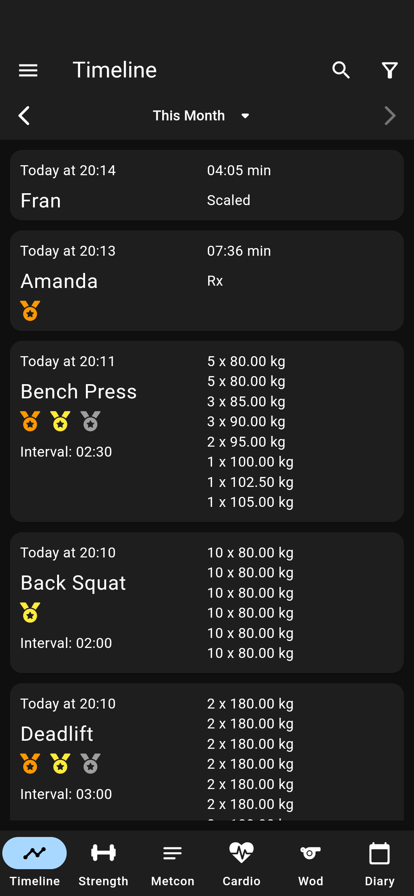
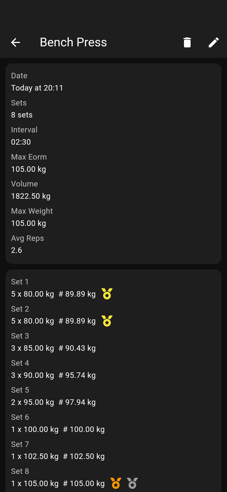
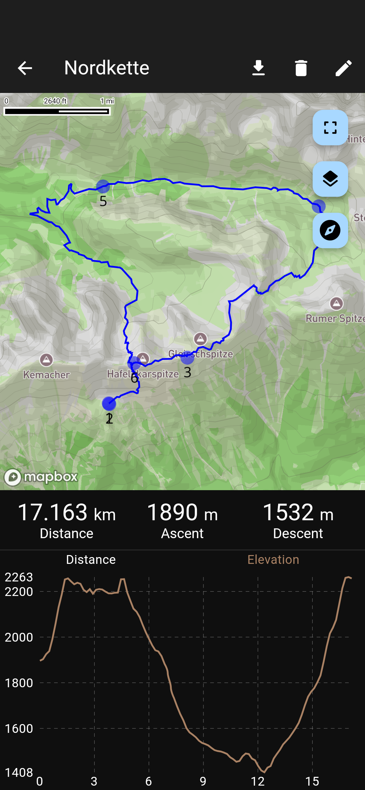
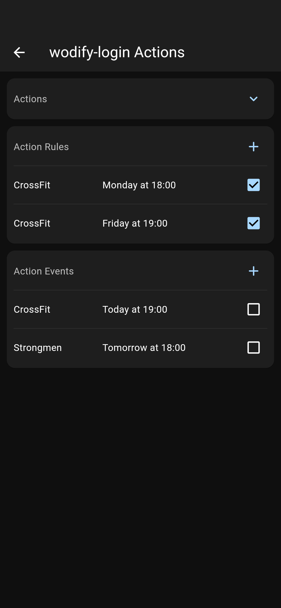

  <picture>
    <source media="(prefers-color-scheme: dark)" srcset="icon-dark.png">
    
  </picture>

<h1 align="center">Sport Log</h1>
  

Sport Log consists of an app written in 🐦 Flutter together with a server backend written in 🦀 Rust.
Additionally, there are action providers which can perform scheduled actions like importing or exporting data from other sources or providing automated reservations on other platforms.
The client and action providers communicate with the server via a REST API.
The client has an own database in order to allow offline use. It synchronizes with the server when connectivity is available.

<table>
  <tr>
    <td></td>
    <td></td>
    <td></td>
    <td></td>
    <td></td>
  </tr>
</table>

[All Screenshots](sport-log-client/SCREENSHOTS.md)

## 🥕 Features

- 🔓 open source and add free
- 🛈 open REST API (server) & export of all data as SQLite DB (client)
- 🔁 auto synchronization & multi device support & offline support
- 🏋️ track strength metrics (input of sets and reps)
- 💯 track metcons (enter scores for predefined or user defined workouts)
- 🏃 GPS tracking for outdoor activities (supports tracking 👣 cadence & 💓 heart rate and 🗣️ voice feedback & 🥁 metronome)
- 🏞 plan routes in advance and use them when tracking (also supports import/ export as GPX)
- 📝 add diary entries
- 📊 statistics about workouts including 🏅 records, 📈 charts, splits and much more
- 🚴 create new movements
- 🗺️ map with different styles (⛺ outdoor, 🚗 street, 🛰️ satellite) support for 🌍 3D and ⛰️ hill shading
- 💾 download offline maps
- ⏱️ timer with different modes (timer, interval, stopwatch)
- 🗓️ schedule task to be executed by action providers on server

## 🏛 Project Structure

The server and action providers as well as helper tools are structured as follows:

- [migrations](migrations) SQL files and methods for server database
- [sport-log-server](sport-log-server) central server backend
- [sport-log-types](sport-log-types) rust types used in all rust crates
- [sport-log-derive](sport-log-derive) rust macros used in [sport-log-types](sport-log-types) and [sport-log-server](sport-log-server)
- [sport-log-scheduler](sport-log-scheduler) responsible for creating action events from action rules, deleting old action events and for garbage collection
- [sport-log-ap-utils](sport-log-ap-utils) helper functions for rust action providers
- [sport-log-action-provider-sportstracker](sport-log-action-provider-sportstracker) fetches new cardio sessions from sportstracker
- [sport-log-action-provider-wodify-login](sport-log-action-provider-wodify-login) reserves spots in wodify classes
- [sport-log-action-provider-wodify-wod](sport-log-action-provider-wodify-wod) fetches and saves the wod description and result from wodify

The flutter app lives in [sport-log-client](sport-log-client)

## 📖 Documentation

Refer to [server docs](sport-log-server/README.md), [client docs](sport-log-client/README.md) and [synchronization docs](SYNCHRONIZATION.md).

## 🤝 Contributing

We would be grateful for any Issues and PRs.

For questions please use the [discussions](https://github.com/LorenzSchueler/sport-log/discussions).

## ⚖ License

[GPL-3.0 License](LICENSE)
