<table style="display: block; overflow-x: scroll; white-space: nowrap;">
  <tr>
    <td></td>
    <td>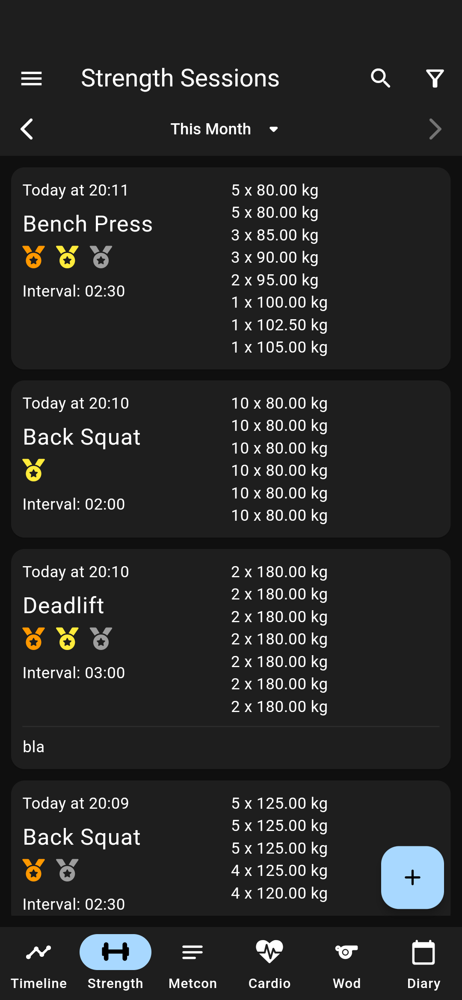</td>
    <td></td>
    <td>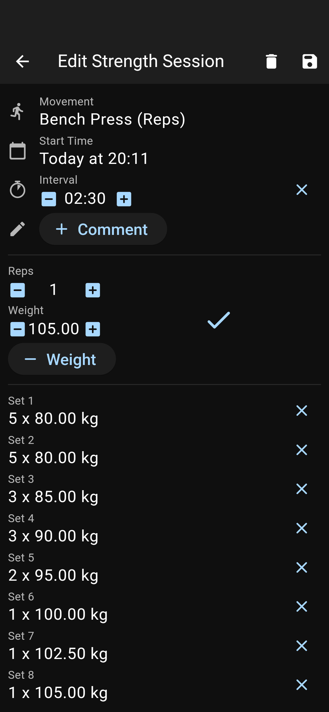</td>
    <td>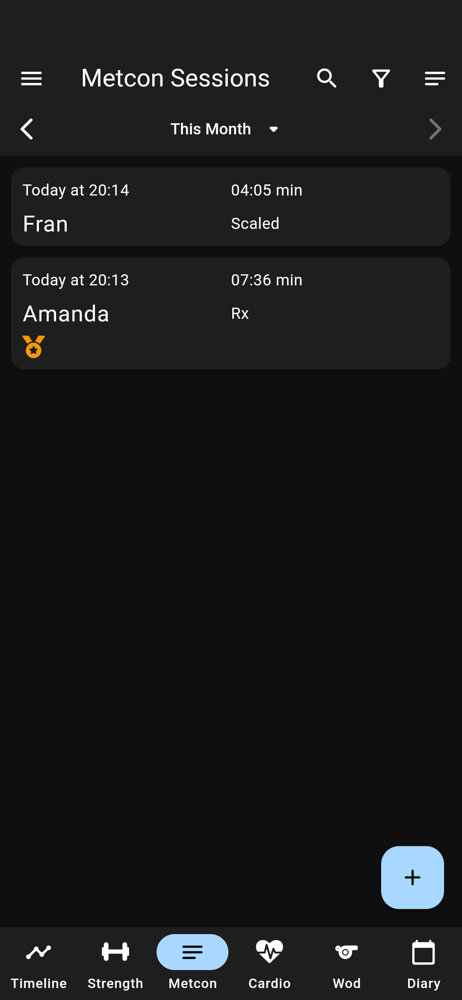</td>
  <tr>
  </tr>
    <td></td>
    <td>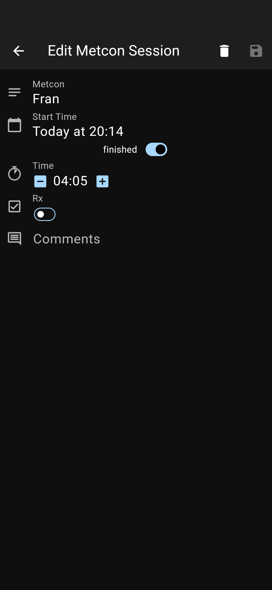</td>
    <td>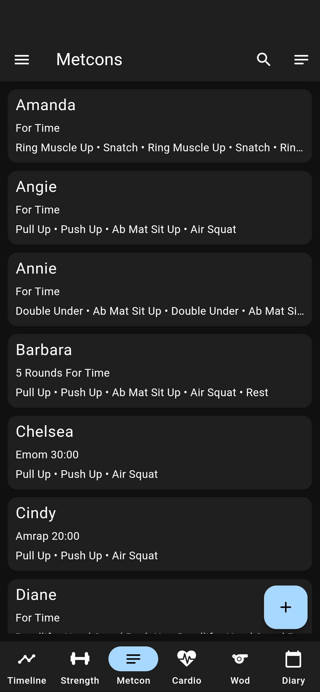</td>
    <td>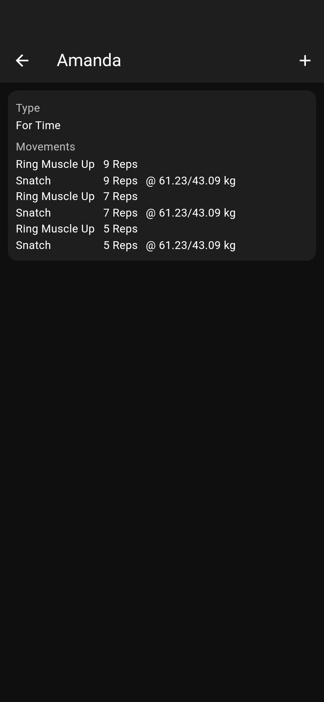</td>
    <td></td>
  <tr>
  </tr>
    <td>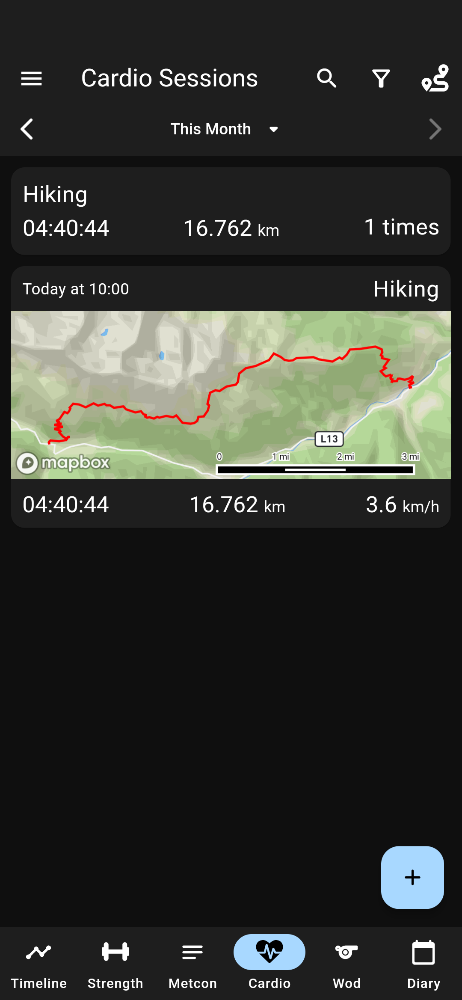</td>
    <td></td>
    <td>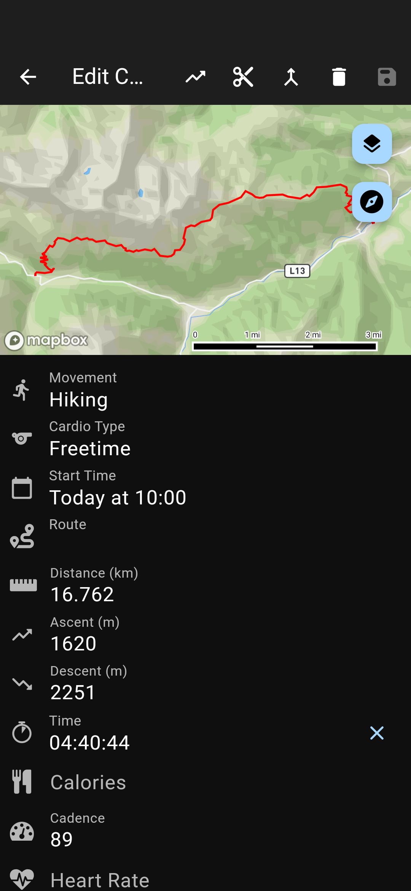</td>
    <td></td>
    <td></td>
  <tr>
  </tr>
    <td>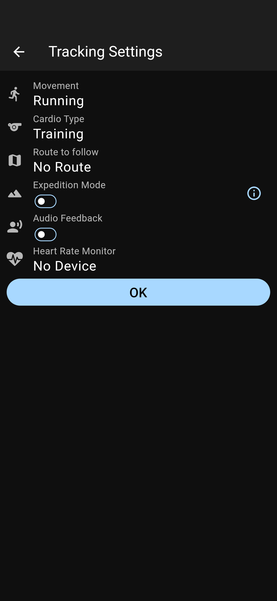</td>
    <td></td>
    <td>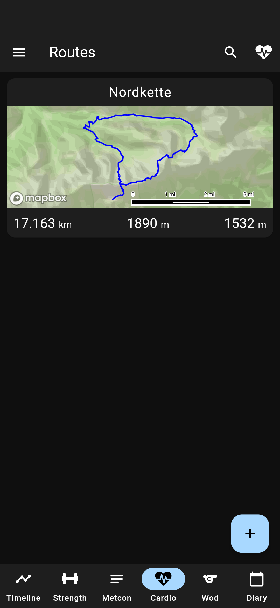</td>
    <td></td>
    <td></td>
  <tr>
  </tr>
    <td></td>
    <td>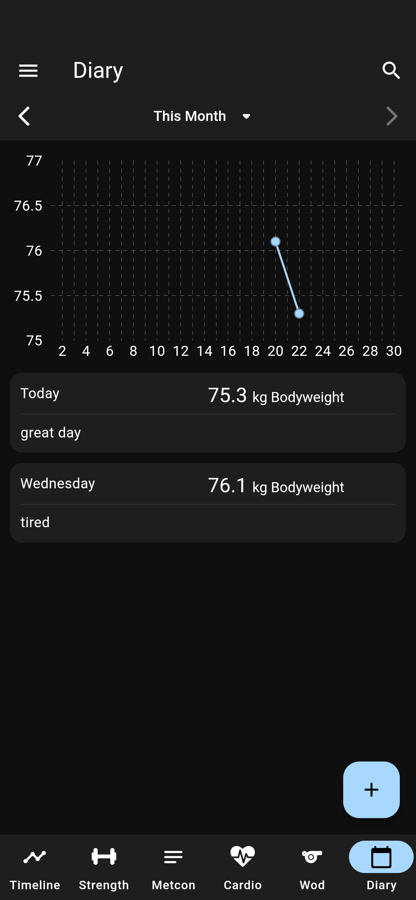</td>
    <td></td>
    <td></td>
    <td>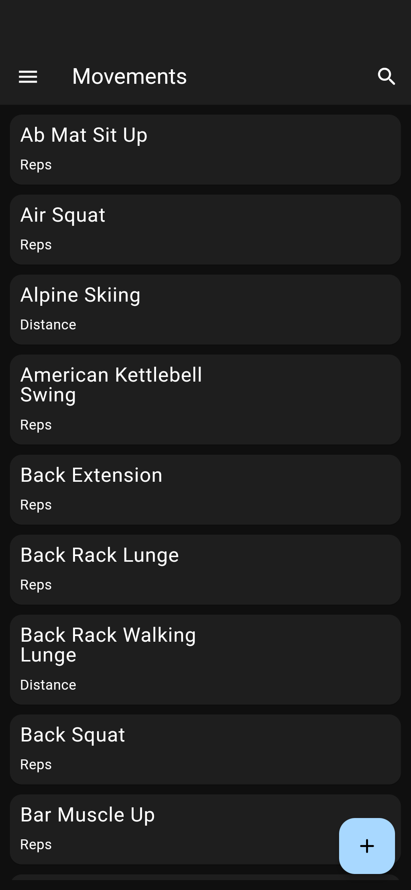</td>
  <tr>
  </tr>
    <td>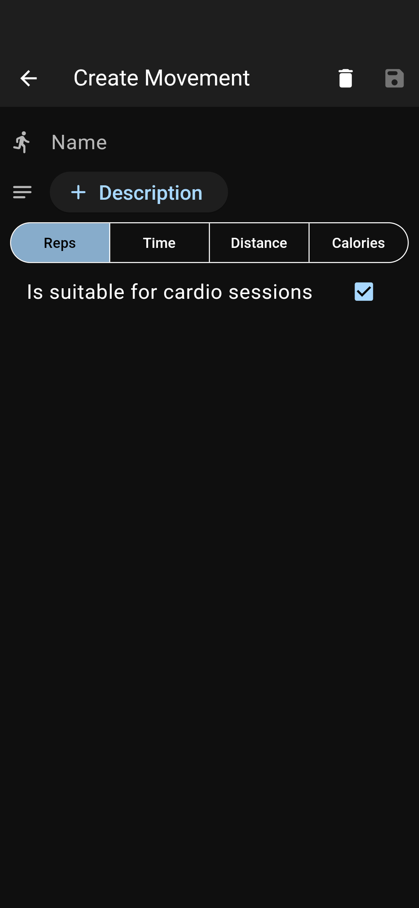</td>
    <td></td>
    <td>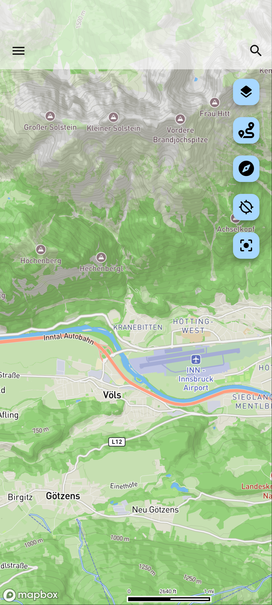</td>
    <td>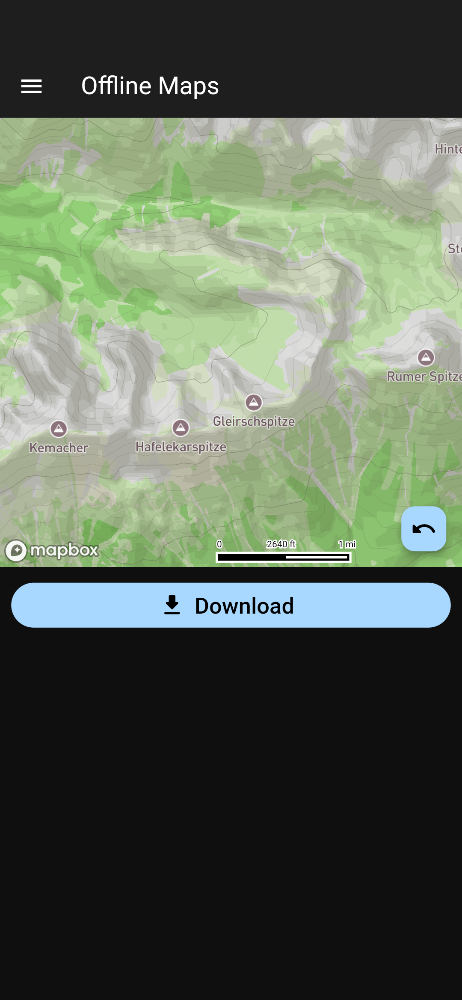</td>
    <td></td>
  <tr>
  </tr>
    <td></td>
    <td></td>
    <td></td>
    <td>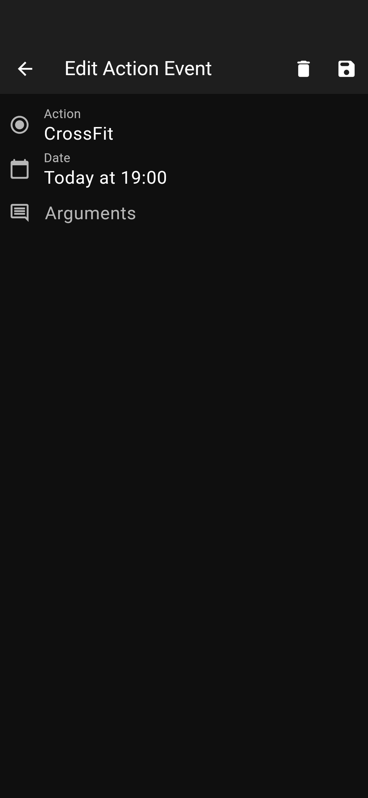</td>
    <td>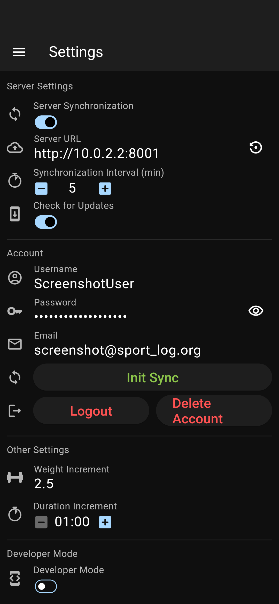</td>
  <tr>
  </tr>
    <td>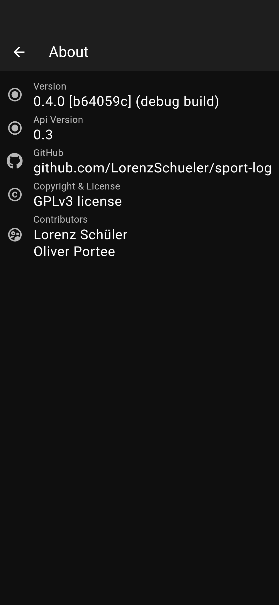</td>
    <td></td>
    <td></td>
  </tr>
</table>
